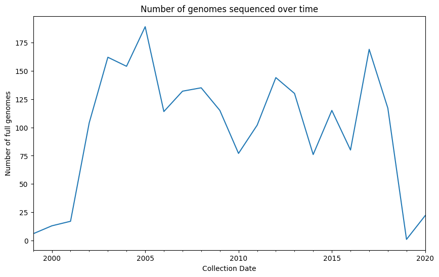
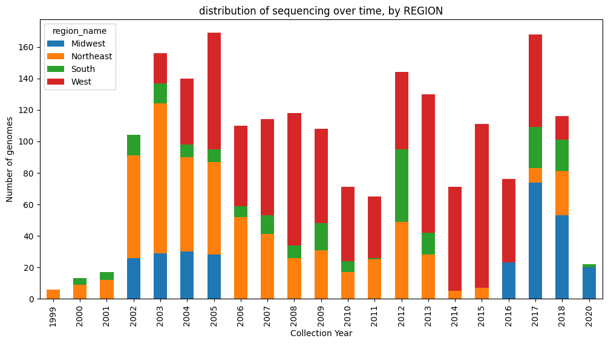
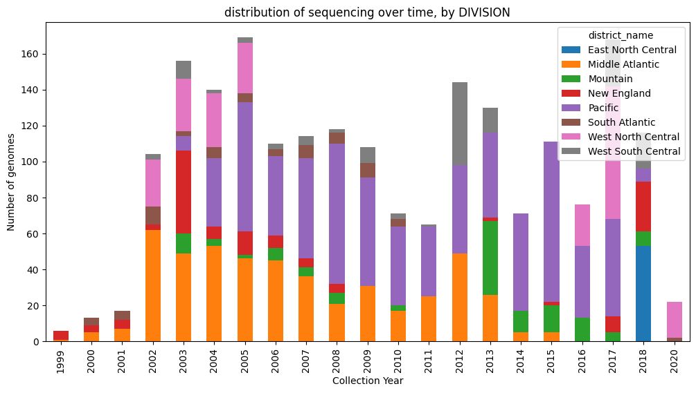
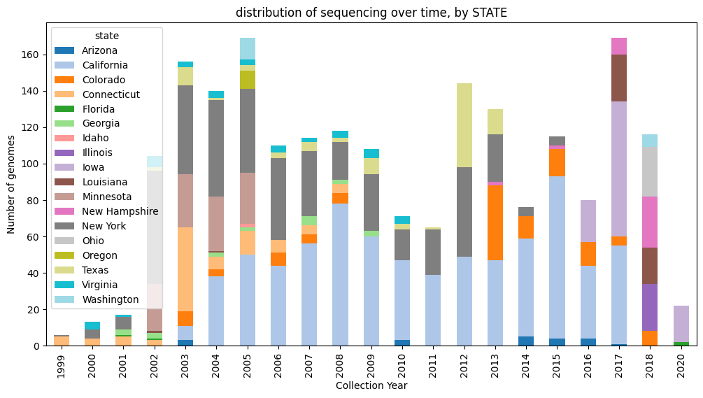
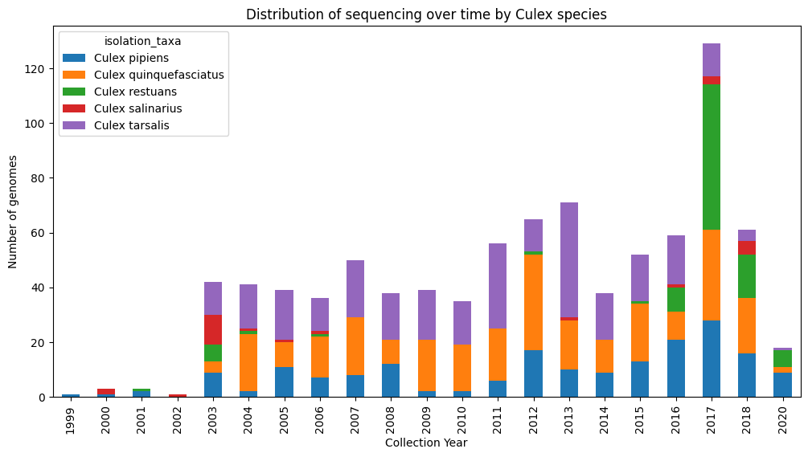
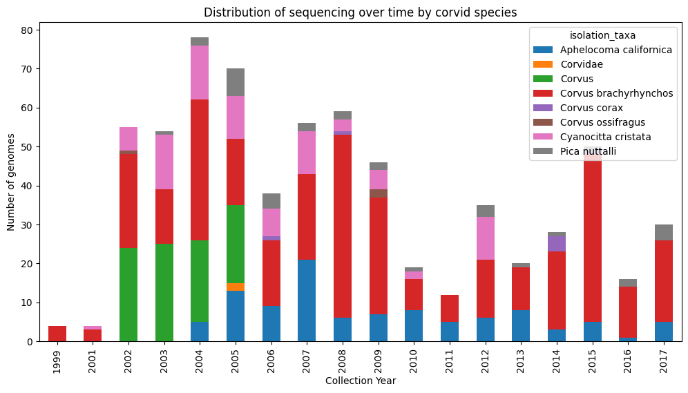
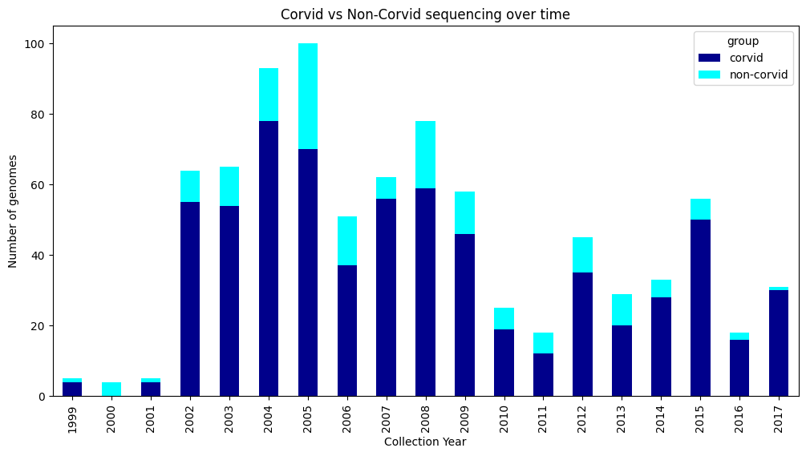
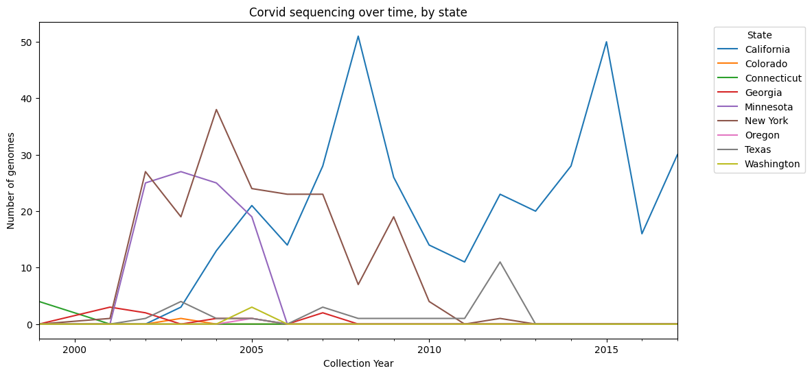
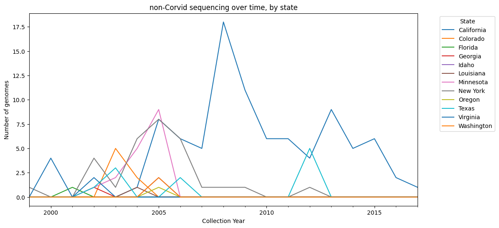

# Summary of West Nile Virus genomes, 1999-2021

Here, metadata associated with ~1800 publicly available genomes that have been sequenced since 1999 are summarized. Genomes that are low quality or don't have county-level geographic metadata associated with them have already been removed in DataCleaning.ipynb


```python
import csv
import numpy as np
import pandas as pd
import matplotlib.pyplot as plt
import matplotlib.cm as cm
from Bio import SeqIO 
from Bio import AlignIO
from scipy.stats import mannwhitneyu
from statsmodels.stats.multitest import multipletests
import plotly.graph_objects as go
import plotly.io as pio
pio.renderers.default = 'iframe'
```


```python
metadata = pd.read_csv('/Users/cwcf/Documents/ORISE/data/Data_products/data_summary/metadata.csv')
```


```python
metadata.head()
```


<div>
<style scoped>
    .dataframe tbody tr th:only-of-type {
        vertical-align: middle;
    }

    .dataframe tbody tr th {
        vertical-align: top;
    }

    .dataframe thead th {
        text-align: right;
    }
</style>
<table border="1" class="dataframe">
  <thead>
    <tr style="text-align: right;">
      <th></th>
      <th>accession</th>
      <th>collection_date</th>
      <th>isolation_source</th>
      <th>isolation_taxa</th>
      <th>city</th>
      <th>county</th>
      <th>state</th>
      <th>FIPS</th>
      <th>region_name</th>
      <th>district_name</th>
      <th>latitude</th>
      <th>longitude</th>
      <th>data_source</th>
      <th>&lt;5% N</th>
    </tr>
  </thead>
  <tbody>
    <tr>
      <th>0</th>
      <td>DQ080053</td>
      <td>2003</td>
      <td>mosquito</td>
      <td>Culex tarsalis</td>
      <td>NaN</td>
      <td>Apache</td>
      <td>Arizona</td>
      <td>4001.0</td>
      <td>West</td>
      <td>Mountain</td>
      <td>NaN</td>
      <td>NaN</td>
      <td>PMID6494762</td>
      <td>1</td>
    </tr>
    <tr>
      <th>1</th>
      <td>DQ080052</td>
      <td>2003</td>
      <td>mosquito</td>
      <td>Culex tarsalis</td>
      <td>NaN</td>
      <td>Maricopa</td>
      <td>Arizona</td>
      <td>4013.0</td>
      <td>West</td>
      <td>Mountain</td>
      <td>NaN</td>
      <td>NaN</td>
      <td>PMID6494762</td>
      <td>1</td>
    </tr>
    <tr>
      <th>2</th>
      <td>DQ080051</td>
      <td>2003</td>
      <td>mosquito</td>
      <td>Culex tarsalis</td>
      <td>NaN</td>
      <td>Cochise</td>
      <td>Arizona</td>
      <td>4003.0</td>
      <td>West</td>
      <td>Mountain</td>
      <td>NaN</td>
      <td>NaN</td>
      <td>PMID6494762</td>
      <td>1</td>
    </tr>
    <tr>
      <th>3</th>
      <td>KF704147</td>
      <td>01-Aug-2010</td>
      <td>mosquito</td>
      <td>Culex quinquefasciatus</td>
      <td>Glendale</td>
      <td>Maricopa</td>
      <td>Arizona</td>
      <td>4013.0</td>
      <td>West</td>
      <td>Mountain</td>
      <td>NaN</td>
      <td>NaN</td>
      <td>PMID24447818</td>
      <td>1</td>
    </tr>
    <tr>
      <th>4</th>
      <td>KF704153</td>
      <td>06-Aug-2010</td>
      <td>mosquito</td>
      <td>Culex quinquefasciatus</td>
      <td>Gilbert</td>
      <td>Maricopa</td>
      <td>Arizona</td>
      <td>4013.0</td>
      <td>West</td>
      <td>Mountain</td>
      <td>NaN</td>
      <td>NaN</td>
      <td>PMID24447818</td>
      <td>1</td>
    </tr>
  </tbody>
</table>
</div>


```python
metadata.shape
```


    (2174, 14)


metadata contains 2,174 rows, each representing a genome, and 14 columns:

**accession:** generally a GenBank accession number for the genome, or the ID number given to unpublished genomes in the WN4k project (e.g. WN001). 
**collection_date:** In datetime format '%d-%b-%y'. When only year was given, date was set to January 1st.  
**isolation_source:** common name for original source of viral isolation - not taking into account any culturing that was done.   
**isolation_taxa:** most descriptive scientific name possible given the original reported isolation source. Mostly to species, some Genus level, occasional Family level.  
**city**: If given.  
**county**: If given, or inferred from given city and state.  
**state** Full name of state.  
**FIPS** fips county code (source: https://github.com/kjhealy/fips-codes/blob/master/county_fips_master.csv).  
**region_name** four major regions in the US (source: https://github.com/kjhealy/fips-codes/blob/master/county_fips_master.csv).  
**district_name** nine divisions in the US (source: https://github.com/kjhealy/fips-codes/blob/master/county_fips_master.csv).     
**latitude**: If given. All in Decimal Degrees.  
**longitude**: If given. All in Decimal Degrees.  
**data_source**: Some identifier of the publication or group that genome came from. usually a pubmed ID or DOI. 
**<5% N**: binary designation for genomes that pass a quality 

### sequencing efforts over time

Now that we have the data loaded, let's first look at how many sequences have been produced over time. 


```python
metadata['collection_date'] = pd.to_datetime(metadata['collection_date'], format='mixed')
data_counts = metadata.resample('y', on='collection_date').size()
plt.figure(figsize=(10,6))
data_counts.plot()
plt.title('Number of genomes sequenced over time')
plt.xlabel('Collection Date')
plt.ylabel('Number of full genomes')
plt.show()
```


    

    


With the exception of the first and last couple years, sequencing efforts seeem to be fairly constant, with at least 75 genomes/year. 

Ideally these would be evenly sample in space as well, so let's add in geographic sources to this plot:


```python
metadata['year'] = pd.to_datetime(metadata['collection_date']).dt.to_period('Y')

# Reshape the data so that each region becomes a column
pivot_df = metadata.pivot_table(index='year', columns='region_name', aggfunc='size', fill_value=0)

# Plot the data
pivot_df.plot.bar(stacked=True, figsize=(12, 6))
plt.title('distribution of sequencing over time, by REGION')
plt.ylabel('Number of genomes')
plt.xlabel('Collection Year')
plt.show()
```


    

    


```python
# Reshape the data so that each division becomes a column
pivot_df = metadata.pivot_table(index='year', columns='district_name', aggfunc='size', fill_value=0)

# Plot the data
pivot_df.plot.bar(stacked=True, figsize=(12, 6))
plt.title('distribution of sequencing over time, by DIVISION')
plt.ylabel('Number of genomes')
plt.xlabel('Collection Year')
plt.show()
```


    

    


```python
# Reshape the data so that each state becomes a column
pivot_df = metadata.pivot_table(index='year', columns='state', aggfunc='size', fill_value=0)

# Generate a list of 18 colors from the 'tab20' colormap
colors = cm.get_cmap('tab20', 18)

# Plot the data
pivot_df.plot.bar(stacked=True, figsize=(12, 6), color=colors.colors)
plt.title('distribution of sequencing over time, by STATE')
plt.ylabel('Number of genomes')
plt.xlabel('Collection Year')
plt.show()
```

    /var/folders/s2/qt6_86yx6slfwqctmjnfnb_00000gn/T/ipykernel_14731/2430304209.py:5: MatplotlibDeprecationWarning:
    
    The get_cmap function was deprecated in Matplotlib 3.7 and will be removed two minor releases later. Use ``matplotlib.colormaps[name]`` or ``matplotlib.colormaps.get_cmap(obj)`` instead.
    


    

    


```python
# Summarize the 'isolation_taxa' column
taxa_counts = metadata['state'].value_counts()

# Print the summary
print(taxa_counts.head(15))
```

    state
    California       750
    New York         483
    Colorado         124
    Iowa             117
    Minnesota        113
    Connecticut      100
    Texas             99
    Louisiana         48
    New Hampshire     41
    Virginia          40
    Ohio              27
    Illinois          26
    Arizona           20
    Georgia           20
    Washington        19
    Name: count, dtype: int64


### Next, let's look at data by isolation source. 


```python
# Summarize the 'isolation_taxa' column
taxa_counts = metadata['isolation_taxa'].value_counts()

# Print the summary
print(taxa_counts.head(30))
```

    isolation_taxa
    Corvus brachyrhynchos     352
    Culex quinquefasciatus    285
    Culex tarsalis            284
    Culex                     193
    Culex pipiens             186
    Aphelocoma californica    102
    Culex restuans             95
    Corvus                     90
    Cyanocitta cristata        85
    Culiseta                   43
    Pica nuttalli              33
    Culex salinarius           27
    Passer domesticus          25
    Culiseta melanura          25
    Homo sapiens               17
    Aedes                      16
    Turdus migratorius         16
    Haemorhous mexicanus       12
    Accipitridae               11
    Accipiter striatus         10
    Culex stigmatosoma          9
    Culex pipiens/restuans      8
    CPG                         8
    Mimus polyglottos           7
    Corvus corax                7
    Culex pipiens male          6
    Aedes cinereus              6
    Quiscalus quiscula          6
    Equus caballus              5
    Coquillettidia              5
    Name: count, dtype: int64


Almost all sequences come from either birds or mosquitoes. 

#### culex mosquitoes


```python
culex_species = ['Culex quinquefasciatus', 'Culex tarsalis', 'Culex pipiens', 'Culex restuans', 'Culex salinarius']

metadata_culex = metadata[metadata['isolation_taxa'].isin(culex_species)]

pivot_df = metadata_culex.pivot_table(index='year', columns='isolation_taxa', aggfunc='size', fill_value=0)

pivot_df.plot.bar(stacked=True, figsize=(12, 6))
plt.title('Distribution of sequencing over time by Culex species')
plt.ylabel('Number of genomes')
plt.xlabel('Collection Year')
plt.show()
```


    

    


#### Birds


```python
# Filter the dataframe
metadata_birds = metadata[metadata['isolation_source'] == 'bird']

# Summarize the 'isolation_taxa' column
bird_taxa_counts = metadata_birds['isolation_taxa'].value_counts()

# Print the summary
print(bird_taxa_counts.head(15))
```

    isolation_taxa
    Corvus brachyrhynchos     351
    Aphelocoma californica    102
    Corvus                     90
    Cyanocitta cristata        85
    Pica nuttalli              33
    Passer domesticus          25
    Turdus migratorius         16
    Haemorhous mexicanus       12
    Accipitridae               11
    Accipiter striatus         10
    Mimus polyglottos           7
    Corvus corax                7
    Quiscalus quiscula          6
    Carpodacus mexicanus        4
    Buteo lineatus              4
    Name: count, dtype: int64


corvids are by far the most commonly sampled birds. While mosquito samples are captured from traps, almost all WNV genomes here come from dead birds, so this bias in the data is mostly due to how high the mortality is in corvids, compunded by the fact that many county surveillance programs now preferentially take in and sample from corvids.


```python
# List of corvids
corvids = ["Corvus brachyrhynchos", "Cyanocitta cristata", "Corvus", "Aphelocoma californica", "Pica nuttalli", "Corvus ossifragus", "Corvidae", "Corvus corax"]

metadata_corvids = metadata[metadata['isolation_taxa'].isin(corvids)]

pivot_df = metadata_corvids.pivot_table(index='year', columns='isolation_taxa', aggfunc='size', fill_value=0)

pivot_df.plot.bar(stacked=True, figsize=(12, 6))
plt.title('Distribution of sequencing over time by corvid species')
plt.ylabel('Number of genomes')
plt.xlabel('Collection Year')
plt.show()
```


    

    


```python
# Create a new column 'group' that contains 'corvid' if the isolation_taxa is a corvid, and 'non-corvid' otherwise
metadata_birds['group'] = metadata['isolation_taxa'].apply(lambda x: 'corvid' if x in corvids else 'non-corvid')

# Reshape the data so that each group becomes a column
pivot_df = metadata_birds.pivot_table(index='year', columns='group', aggfunc='size', fill_value=0)

# Plot the data
pivot_df.plot.bar(stacked=True, figsize=(12, 6), color=["darkblue","cyan"])
plt.title('Corvid vs Non-Corvid sequencing over time')
plt.ylabel('Number of genomes')
plt.xlabel('Collection Year')
plt.show()
```


    

    


### Corvid sequencing over time, by state


```python
import matplotlib.pyplot as plt

# Group the data by 'year' and 'state'
grouped_df = metadata_birds[metadata_birds['group'] == 'corvid'].groupby(['year', 'state']).size().reset_index(name='count')

# Pivot the data so that each state becomes a column
pivot_df = grouped_df.pivot(index='year', columns='state', values='count').fillna(0)

# Plot the data
pivot_df.plot.line(figsize=(12, 6))
plt.title('Corvid sequencing over time, by state')
plt.ylabel('Number of genomes')
plt.xlabel('Collection Year')
plt.legend(title='State', bbox_to_anchor=(1.05, 1), loc='upper left')
plt.show()
```


    

    


```python
import matplotlib.pyplot as plt

# Group the data by 'year' and 'state'
grouped_df = metadata_birds[metadata_birds['group'] == 'non-corvid'].groupby(['year', 'state']).size().reset_index(name='count')

# Pivot the data so that each state becomes a column
pivot_df = grouped_df.pivot(index='year', columns='state', values='count').fillna(0)

# Plot the data
pivot_df.plot.line(figsize=(12, 6))
plt.title('non-Corvid sequencing over time, by state')
plt.ylabel('Number of genomes')
plt.xlabel('Collection Year')
plt.legend(title='State', bbox_to_anchor=(1.05, 1), loc='upper left')
plt.show()
```


    

    

